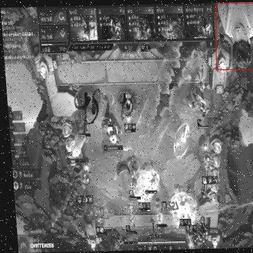

# 主播和礼品检测检测系统源码分享
 # [一条龙教学YOLOV8标注好的数据集一键训练_70+全套改进创新点发刊_Web前端展示]

### 1.研究背景与意义

项目参考[AAAI Association for the Advancement of Artificial Intelligence](https://gitee.com/qunshansj/projects)

项目来源[AACV Association for the Advancement of Computer Vision](https://gitee.com/qunmasj/projects)

研究背景与意义

随着互联网技术的迅猛发展，直播行业在近年来蓬勃兴起，成为了人们日常生活中不可或缺的一部分。直播不仅为用户提供了丰富的娱乐内容，也为内容创作者带来了新的收入来源。在这一过程中，主播与观众之间的互动显得尤为重要，尤其是在直播打赏和礼品赠送的环节，成为了推动直播经济的重要因素。然而，随着直播行业的快速发展，如何有效地识别和管理直播过程中的礼品和打赏行为，成为了一个亟待解决的问题。

本研究旨在基于改进的YOLOv8模型，构建一个高效的主播和礼品检测系统，以提升直播平台的管理效率和用户体验。YOLO（You Only Look Once）系列模型因其实时性和高准确率，广泛应用于目标检测领域。YOLOv8作为该系列的最新版本，具有更强的特征提取能力和更快的推理速度，适合处理复杂的直播场景。通过对YOLOv8的改进，我们可以进一步提升其在主播和礼品检测中的表现，使其能够在多变的直播环境中准确识别出主播和观众的互动行为。

在本研究中，我们使用的数据集包含1992张图像，涵盖了两个主要类别：捐赠（donation）和主播（streamer）。这些数据不仅为模型的训练提供了丰富的样本，也为后续的模型评估和优化奠定了基础。通过对这两个类别的深入分析，我们可以识别出不同类型的捐赠行为和主播特征，从而为直播平台提供更加精准的用户画像和行为分析。这不仅有助于平台在内容推荐和广告投放方面的优化，也为主播提供了更为清晰的互动数据，帮助他们提升与观众的互动质量。

此外，主播和礼品检测系统的构建还有助于提升直播平台的安全性和合规性。在当前的直播环境中，虚假打赏和恶意行为时有发生，给平台和主播带来了潜在的风险。通过实时监测和识别打赏行为，平台可以及时发现并处理异常情况，保护主播的合法权益，维护良好的直播生态。

综上所述，基于改进YOLOv8的主播和礼品检测系统的研究，不仅具有重要的学术价值，也在实际应用中具有广泛的意义。它将为直播行业的健康发展提供技术支持，推动直播经济的可持续增长。通过提升主播与观众之间的互动质量，增强用户体验，最终实现多方共赢的局面。因此，本研究的开展具有重要的理论意义和实践价值，为未来的直播技术研究和应用提供了新的思路和方向。

### 2.图片演示


##### 注意：由于此博客编辑较早，上面“2.图片演示”和“3.视频演示”展示的系统图片或者视频可能为老版本，新版本在老版本的基础上升级如下：（实际效果以升级的新版本为准）

  （1）适配了YOLOV8的“目标检测”模型和“实例分割”模型，通过加载相应的权重（.pt）文件即可自适应加载模型。

  （2）支持“图片识别”、“视频识别”、“摄像头实时识别”三种识别模式。

  （3）支持“图片识别”、“视频识别”、“摄像头实时识别”三种识别结果保存导出，解决手动导出（容易卡顿出现爆内存）存在的问题，识别完自动保存结果并导出到tempDir中。

  （4）支持Web前端系统中的标题、背景图等自定义修改，后面提供修改教程。

  另外本项目提供训练的数据集和训练教程,暂不提供权重文件（best.pt）,需要您按照教程进行训练后实现图片演示和Web前端界面演示的效果。

### 3.视频演示

[3.1 视频演示](https://www.bilibili.com/video/BV1wT4SeiEuL/)

### 4.数据集信息展示

##### 4.1 本项目数据集详细数据（类别数＆类别名）

nc: 2
names: ['donation', 'streamer']


##### 4.2 本项目数据集信息介绍

数据集信息展示

在现代直播和在线互动的环境中，主播与观众之间的互动越来越频繁，尤其是在礼品和捐赠的场景中，主播的表现和观众的参与度直接影响着直播的成功与否。为了提升YOLOv8在主播和礼品检测方面的性能，我们构建了一个名为“EOWPTLWS”的数据集，专门用于训练和优化该系统。该数据集的设计旨在涵盖主播直播过程中可能出现的各种场景，以确保模型能够准确识别和分类相关对象。

“EOWPTLWS”数据集包含两大类对象，分别是“donation”（捐赠）和“streamer”（主播）。这两类对象在直播场景中具有重要的意义，捐赠不仅是观众对主播内容的认可和支持，同时也是主播与观众之间情感交流的重要方式。而主播则是整个直播活动的核心，负责内容的创造和观众的互动。因此，准确检测这两类对象对于提升直播质量和观众体验至关重要。

在数据集的构建过程中，我们采用了多种数据采集方式，包括从真实直播平台截取视频片段、收集直播录制文件以及利用合成数据生成技术，以确保数据的多样性和丰富性。数据集中包含了各种不同的直播场景，例如游戏直播、音乐演出、在线教学等，这些场景中的主播表现和观众互动方式各不相同，能够为模型提供丰富的学习样本。

每个类别的数据样本都经过精心标注，确保模型在训练过程中能够学习到准确的特征。对于“donation”类别，我们收集了包含捐赠信息的直播画面，这些画面中通常会出现捐赠金额、捐赠者昵称等信息。通过这些样本，模型能够学习到如何识别和理解捐赠行为的视觉特征。对于“streamer”类别，我们则聚焦于主播的表现、姿态和与观众的互动方式，确保模型能够准确识别出主播在直播过程中的各种状态。

此外，为了提高模型的泛化能力，我们在数据集中引入了多样化的光照条件、背景环境和摄像机角度。这种多样性使得模型在面对不同直播环境时，依然能够保持较高的检测准确率。数据集中的每个样本都经过严格的质量控制，确保标注的准确性和一致性，从而为后续的模型训练提供可靠的基础。

在训练过程中，我们将“EOWPTLWS”数据集与YOLOv8模型相结合，利用其强大的特征提取能力和实时检测性能，旨在实现对主播和礼品的高效识别。通过不断的迭代和优化，我们希望能够提升模型在实际应用中的表现，使其能够在复杂的直播环境中，快速、准确地识别出主播和捐赠行为，从而为直播行业的发展贡献一份力量。

总之，“EOWPTLWS”数据集不仅为YOLOv8的改进提供了丰富的训练素材，也为未来的研究和应用奠定了坚实的基础。通过对主播和礼品的精准检测，我们期待能够推动直播技术的进步，提升观众的参与感和满意度。





### 5.全套项目环境部署视频教程（零基础手把手教学）

[5.1 环境部署教程链接（零基础手把手教学）](https://www.ixigua.com/7404473917358506534?logTag=c807d0cbc21c0ef59de5)


[5.2 安装Python虚拟环境创建和依赖库安装视频教程链接（零基础手把手教学）](https://www.ixigua.com/7404474678003106304?logTag=1f1041108cd1f708b01a)

### 6.手把手YOLOV8训练视频教程（零基础小白有手就能学会）

[6.1 手把手YOLOV8训练视频教程（零基础小白有手就能学会）](https://www.ixigua.com/7404477157818401292?logTag=d31a2dfd1983c9668658)

### 7.70+种全套YOLOV8创新点代码加载调参视频教程（一键加载写好的改进模型的配置文件）

[7.1 70+种全套YOLOV8创新点代码加载调参视频教程（一键加载写好的改进模型的配置文件）](https://www.ixigua.com/7404478314661806627?logTag=29066f8288e3f4eea3a4)

### 8.70+种全套YOLOV8创新点原理讲解（非科班也可以轻松写刊发刊，V10版本正在科研待更新）

由于篇幅限制，每个创新点的具体原理讲解就不一一展开，具体见下列网址中的创新点对应子项目的技术原理博客网址【Blog】：


[8.1 70+种全套YOLOV8创新点原理讲解链接](https://gitee.com/qunmasj/good)

### 9.系统功能展示（检测对象为举例，实际内容以本项目数据集为准）

图9.1.系统支持检测结果表格显示

  图9.2.系统支持置信度和IOU阈值手动调节

  图9.3.系统支持自定义加载权重文件best.pt(需要你通过步骤5中训练获得)

  图9.4.系统支持摄像头实时识别

  图9.5.系统支持图片识别

  图9.6.系统支持视频识别

  图9.7.系统支持识别结果文件自动保存

  图9.8.系统支持Excel导出检测结果数据


### 10.原始YOLOV8算法原理

原始YOLOv8算法原理

YOLOv8是由Ultralytics于2023年发布的一款先进的目标检测算法，作为YOLO系列的最新版本，它在前几代的基础上进行了多项创新和改进，旨在实现更高的检测精度和更快的推理速度。YOLOv8不仅仅是一个简单的模型更新，而是通过整合多种先进技术，形成了一种全新的网络架构，能够更好地适应不同的应用场景。

YOLOv8的网络结构可以分为三个主要部分：输入端（Input）、主干网络（Backbone）和检测端（Head）。在输入端，YOLOv8默认接受640x640的图像尺寸，但为了适应不同长宽比的图像，算法采用了一种自适应缩放策略。这种策略通过将图像的长边缩放到指定尺寸，并对短边进行填充，从而最大限度地减少信息冗余，提升了目标检测的速度和效率。此外，在训练过程中，YOLOv8引入了Mosaic数据增强技术，通过将四张不同的图像随机拼接成一张新图像，迫使模型学习不同的目标位置和周围像素，从而提高了模型的泛化能力和预测精度。

在主干网络部分，YOLOv8的设计灵感来源于YOLOv7中的ELAN模块，并对YOLOv5中的C3模块进行了改进，推出了C2f模块。C2f模块通过增加更多的残差连接，使得网络在保持轻量化的同时，能够获得更丰富的梯度信息。这种设计使得YOLOv8在特征提取方面表现得更加出色，能够更好地捕捉到目标的细节特征。C2f模块的结构相较于C3模块，采用了更为灵活的并行梯度流设计，从而在提高精度的同时，合理控制了延迟。

在Neck部分，YOLOv8对YOLOv5的结构进行了简化，去除了上采样过程中的卷积层，直接对不同阶段输出的特征进行上采样。这种设计不仅减少了计算量，还提高了特征融合的效率，使得网络能够更快地处理输入数据。

YOLOv8的Head部分是其最大的创新之一。传统的YOLO系列算法通常采用耦合头结构，即分类和检测任务共用同一卷积层，而YOLOv8则采用了解耦合头结构，将分类和检测任务分开处理。这种解耦合设计使得模型在进行目标检测时能够更好地专注于每个任务，从而提高了整体性能。此外，YOLOv8摒弃了传统的Anchor-Based方法，转而采用Anchor-Free的策略，将目标检测转化为关键点检测。这一转变使得YOLOv8在处理不同尺度和形状的目标时更加灵活，减少了对预设锚框的依赖，从而提高了模型的泛化能力。

在损失函数的设计上，YOLOv8采用了BCELoss作为分类损失，DFLLoss和CIoULoss作为回归损失。这种组合损失函数的设计旨在使模型能够快速聚焦于标签附近的数值，提高检测的准确性和稳定性。BCELoss能够有效处理二分类问题，而DFLLoss则通过引入分布焦点损失，使得模型在训练过程中更加关注难以检测的目标，进而提升了整体的检测性能。

YOLOv8的多种模型配置（如n、s、m、l、x）为不同的应用场景提供了灵活的选择。每种模型在深度、特征图宽度和通道数上都有所不同，旨在通过调整这些参数来实现最佳的性能表现。这种灵活性使得YOLOv8能够广泛应用于目标检测、图像分割和图像分类等多种任务，成为研究人员和工程师们的理想选择。

总的来说，YOLOv8的设计理念围绕着快速、准确和易用展开，通过引入先进的网络结构和创新的算法策略，成功地提升了目标检测的性能。其在COCO数据集上的表现也证明了这一点，YOLOv8不仅在检测精度上达到了新的高度，同时在推理速度上也保持了良好的表现。这些优势使得YOLOv8在目标检测领域具有广泛的应用前景，尤其是在需要实时处理的场景中，如自动驾驶、安防监控和智能制造等领域。通过不断的技术迭代和创新，YOLOv8将为目标检测领域带来新的冲击和机遇。


### 11.项目核心源码讲解（再也不用担心看不懂代码逻辑）

#### 11.1 ui.py

以下是经过精简和注释的核心代码：

```python
import sys
import subprocess

def run_script(script_path):
    """
    使用当前 Python 环境运行指定的脚本。

    Args:
        script_path (str): 要运行的脚本路径
    """
    # 获取当前 Python 解释器的路径
    python_path = sys.executable

    # 构建运行命令，使用 streamlit 运行指定的脚本
    command = f'"{python_path}" -m streamlit run "{script_path}"'

    # 执行命令并等待其完成
    result = subprocess.run(command, shell=True)
    
    # 检查命令执行结果，如果返回码不为0，表示出错
    if result.returncode != 0:
        print("脚本运行出错。")

# 主程序入口
if __name__ == "__main__":
    # 指定要运行的脚本路径
    script_path = "web.py"  # 假设脚本在当前目录下

    # 调用函数运行脚本
    run_script(script_path)
```

### 代码注释说明：
1. **导入模块**：
   - `sys`：用于获取当前 Python 解释器的路径。
   - `subprocess`：用于执行外部命令。

2. **`run_script` 函数**：
   - 该函数接收一个脚本路径作为参数，并使用当前 Python 环境运行该脚本。
   - 使用 `sys.executable` 获取当前 Python 解释器的路径。
   - 构建命令字符串，使用 `streamlit` 运行指定的脚本。
   - 使用 `subprocess.run` 执行命令，并等待其完成。
   - 检查命令的返回码，如果不为0，则输出错误信息。

3. **主程序入口**：
   - 使用 `if __name__ == "__main__":` 确保只有在直接运行该脚本时才会执行以下代码。
   - 指定要运行的脚本路径（在此示例中为 `web.py`）。
   - 调用 `run_script` 函数以运行指定的脚本。

这个文件名为 `ui.py`，它的主要功能是通过当前的 Python 环境来运行一个指定的脚本，具体是使用 Streamlit 来启动一个 Web 应用。

首先，文件中导入了一些必要的模块，包括 `sys`、`os` 和 `subprocess`。其中，`sys` 模块用于访问与 Python 解释器相关的变量和函数，`os` 模块提供了与操作系统交互的功能，而 `subprocess` 模块则用于生成新的进程、连接到它们的输入/输出/错误管道，并获取它们的返回码。

接下来，文件中定义了一个名为 `run_script` 的函数，该函数接受一个参数 `script_path`，表示要运行的脚本的路径。在函数内部，首先通过 `sys.executable` 获取当前 Python 解释器的路径。然后，构建一个命令字符串，该命令使用 Streamlit 来运行指定的脚本。具体的命令格式为 `"{python_path}" -m streamlit run "{script_path}"`，其中 `{python_path}` 和 `{script_path}` 分别被替换为实际的 Python 解释器路径和脚本路径。

随后，使用 `subprocess.run` 方法来执行构建好的命令，并设置 `shell=True` 以在 shell 中运行该命令。执行后，检查返回码 `result.returncode`，如果返回码不为 0，表示脚本运行出错，则打印一条错误信息。

在文件的最后部分，使用 `if __name__ == "__main__":` 语句来确保当该文件作为主程序运行时，下面的代码才会被执行。在这里，指定了要运行的脚本路径为 `web.py`，并调用 `run_script` 函数来执行这个脚本。

总体来说，这个 `ui.py` 文件的作用是作为一个启动器，方便用户通过当前的 Python 环境来运行一个 Streamlit 应用，具体的应用逻辑则在 `web.py` 文件中实现。

#### 11.2 70+种YOLOv8算法改进源码大全和调试加载训练教程（非必要）\ultralytics\engine\exporter.py

以下是代码中最核心的部分，并附上详细的中文注释：

```python
class Exporter:
    """
    用于导出模型的类。

    属性:
        args (SimpleNamespace): 导出器的配置。
        callbacks (list, optional): 回调函数列表。默认为 None。
    """

    def __init__(self, cfg=DEFAULT_CFG, overrides=None, _callbacks=None):
        """
        初始化 Exporter 类。

        参数:
            cfg (str, optional): 配置文件的路径。默认为 DEFAULT_CFG。
            overrides (dict, optional): 配置覆盖。默认为 None。
            _callbacks (dict, optional): 回调函数的字典。默认为 None。
        """
        self.args = get_cfg(cfg, overrides)  # 获取配置
        self.callbacks = _callbacks or callbacks.get_default_callbacks()  # 设置回调函数

    @smart_inference_mode()
    def __call__(self, model=None):
        """在运行回调后返回导出的文件/目录列表。"""
        self.run_callbacks('on_export_start')  # 运行导出开始的回调
        fmt = self.args.format.lower()  # 将格式转换为小写
        fmts = tuple(export_formats()['Argument'][1:])  # 可用的导出格式
        flags = [x == fmt for x in fmts]  # 检查所选格式是否有效
        if sum(flags) != 1:
            raise ValueError(f"无效的导出格式='{fmt}'。有效格式为 {fmts}")

        # 设备选择
        self.device = select_device('cpu' if self.args.device is None else self.args.device)

        # 检查模型名称
        model.names = check_class_names(model.names)

        # 输入张量
        im = torch.zeros(self.args.batch, 3, *self.imgsz).to(self.device)  # 创建输入张量

        # 更新模型
        model = deepcopy(model).to(self.device)  # 深拷贝模型并移动到指定设备
        model.eval()  # 设置模型为评估模式
        model.float()  # 转换为浮点数

        # 进行干运行以确保模型正常工作
        y = None
        for _ in range(2):
            y = model(im)  # 进行干运行

        # 导出模型
        f = [''] * len(fmts)  # 导出文件名列表
        if 'torchscript' in fmt:  # 导出为 TorchScript
            f[0], _ = self.export_torchscript()
        if 'onnx' in fmt:  # 导出为 ONNX
            f[1], _ = self.export_onnx()

        # 完成导出
        f = [str(x) for x in f if x]  # 过滤出有效的文件名
        self.run_callbacks('on_export_end')  # 运行导出结束的回调
        return f  # 返回导出的文件/目录列表

    @try_export
    def export_onnx(self, prefix=colorstr('ONNX:')):
        """导出 YOLOv8 ONNX 模型。"""
        opset_version = self.args.opset or get_latest_opset()  # 获取 ONNX 的 opset 版本
        f = str(self.file.with_suffix('.onnx'))  # 设置导出文件名

        # 导出模型
        torch.onnx.export(
            self.model.cpu(),  # 将模型移动到 CPU
            self.im.cpu(),  # 将输入张量移动到 CPU
            f,
            opset_version=opset_version,
            input_names=['images'],  # 输入名称
            output_names=['output0'],  # 输出名称
        )

        return f, None  # 返回导出文件名
```

### 代码说明：
1. **Exporter 类**：负责处理模型的导出操作，包括初始化配置、选择设备、检查模型、执行导出等。
2. **__init__ 方法**：初始化导出器，设置配置和回调函数。
3. **__call__ 方法**：执行导出操作，处理模型的输入和输出，并根据所需格式导出模型。
4. **export_onnx 方法**：具体实现导出为 ONNX 格式的逻辑，使用 PyTorch 的 `torch.onnx.export` 方法进行导出。

### 关键点：
- 通过 `get_cfg` 函数获取配置。
- 使用 `select_device` 函数选择运行设备（CPU/GPU）。
- 通过深拷贝确保模型在导出过程中不被修改。
- 进行干运行以确保模型的正确性。
- 支持多种导出格式（如 ONNX、TorchScript 等）。

这个程序文件是一个用于将YOLOv8模型导出为多种格式的Python脚本，文件名为`exporter.py`，它是Ultralytics YOLO项目的一部分。该脚本支持将训练好的YOLOv8模型导出为多种格式，包括PyTorch、TorchScript、ONNX、OpenVINO、TensorRT、CoreML、TensorFlow SavedModel、TensorFlow GraphDef、TensorFlow Lite、TensorFlow Edge TPU、TensorFlow.js、PaddlePaddle和ncnn等。文件开头包含了各种导出格式的列表及其对应的参数。

在代码中，首先导入了一些必要的库和模块，包括JSON处理、文件操作、时间处理、警告管理、深度学习框架PyTorch等。接着定义了一些辅助函数和类，用于处理模型导出过程中的各种操作。

`export_formats`函数返回一个包含所有支持的导出格式的DataFrame，方便后续调用。`gd_outputs`函数用于获取TensorFlow GraphDef模型的输出节点名称。`try_export`是一个装饰器，用于捕获导出过程中的异常并记录日志。

`Exporter`类是导出过程的核心，负责处理模型的导出。其构造函数接受配置文件路径、覆盖参数和回调函数等参数，并初始化相应的属性。`__call__`方法是导出模型的主要逻辑，首先运行导出开始的回调，然后根据用户指定的格式进行模型导出，支持的格式通过一系列条件判断进行处理。

在导出过程中，代码会检查设备类型、模型参数、输入图像大小等，确保导出过程的顺利进行。模型会在导出前进行一些必要的处理，比如将模型转为评估模式、禁用梯度计算等。然后根据不同的导出格式调用相应的导出方法，例如`export_torchscript`、`export_onnx`、`export_openvino`等，每个导出方法都实现了特定格式的导出逻辑。

在每个导出方法中，都会记录导出过程的日志信息，并在成功导出后返回导出的文件路径。在导出完成后，代码会运行导出结束的回调，并返回导出的文件列表。

总的来说，这个文件实现了YOLOv8模型的多格式导出功能，提供了灵活的配置选项和详细的日志记录，方便用户将训练好的模型应用于不同的深度学习框架和平台。

#### 11.3 70+种YOLOv8算法改进源码大全和调试加载训练教程（非必要）\ultralytics\utils\loss.py

以下是经过简化和注释的核心代码部分，主要包括损失函数的实现。这些损失函数用于训练YOLO模型，尤其是在目标检测、分割和关键点检测任务中。

```python
import torch
import torch.nn as nn
import torch.nn.functional as F

class BboxLoss(nn.Module):
    def __init__(self, reg_max, use_dfl=False):
        """初始化边界框损失模块，设置最大正则化值和DFL使用标志"""
        super().__init__()
        self.reg_max = reg_max  # 最大正则化值
        self.use_dfl = use_dfl  # 是否使用分布焦点损失
        self.iou_ratio = 0.5  # IoU比率

    def forward(self, pred_dist, pred_bboxes, anchor_points, target_bboxes, target_scores, target_scores_sum, fg_mask):
        """计算IoU损失和DFL损失"""
        weight = target_scores.sum(-1)[fg_mask].unsqueeze(-1)  # 计算权重
        iou = bbox_iou(pred_bboxes[fg_mask], target_bboxes[fg_mask], xywh=False, CIoU=True)  # 计算IoU
        loss_iou = ((1.0 - iou) * weight).sum() / target_scores_sum  # IoU损失

        # DFL损失
        if self.use_dfl:
            target_ltrb = bbox2dist(anchor_points, target_bboxes, self.reg_max)  # 将目标框转换为分布
            loss_dfl = self._df_loss(pred_dist[fg_mask].view(-1, self.reg_max + 1), target_ltrb[fg_mask]) * weight
            loss_dfl = loss_dfl.sum() / target_scores_sum  # DFL损失
        else:
            loss_dfl = torch.tensor(0.0).to(pred_dist.device)  # 如果不使用DFL，损失为0

        return loss_iou, loss_dfl  # 返回IoU损失和DFL损失

    @staticmethod
    def _df_loss(pred_dist, target):
        """计算分布焦点损失"""
        tl = target.long()  # 目标左边界
        tr = tl + 1  # 目标右边界
        wl = tr - target  # 左边权重
        wr = 1 - wl  # 右边权重
        return (F.cross_entropy(pred_dist, tl.view(-1), reduction='none').view(tl.shape) * wl +
                F.cross_entropy(pred_dist, tr.view(-1), reduction='none').view(tl.shape) * wr).mean(-1, keepdim=True)

class v8DetectionLoss:
    """计算YOLO模型的训练损失"""
    
    def __init__(self, model):
        """初始化检测损失类，设置模型相关属性和BCE损失函数"""
        device = next(model.parameters()).device  # 获取模型设备
        m = model.model[-1]  # 获取检测模块
        self.bce = nn.BCEWithLogitsLoss(reduction='none')  # 使用BCE损失
        self.bbox_loss = BboxLoss(m.reg_max - 1, use_dfl=True).to(device)  # 初始化边界框损失

    def __call__(self, preds, batch):
        """计算总损失并返回"""
        loss = torch.zeros(3, device=self.device)  # 初始化损失向量
        pred_bboxes = self.bbox_decode(preds)  # 解码预测的边界框
        target_bboxes = batch['bboxes']  # 获取目标边界框

        # 计算损失
        loss[0], loss[1] = self.bbox_loss(pred_bboxes, target_bboxes)  # 计算边界框损失
        loss[2] = self.bce(preds, batch['cls'])  # 计算分类损失

        return loss.sum()  # 返回总损失
```

### 代码说明：
1. **BboxLoss类**：实现了边界框损失的计算，包括IoU损失和可选的分布焦点损失（DFL）。
   - `forward`方法计算IoU损失和DFL损失。
   - `_df_loss`静态方法计算分布焦点损失。

2. **v8DetectionLoss类**：用于计算YOLO模型的检测损失。
   - 在初始化时设置BCE损失和边界框损失。
   - `__call__`方法计算并返回总损失，包括边界框损失和分类损失。

这些损失函数是YOLO模型训练的核心，负责衡量模型预测与真实标签之间的差异，从而指导模型的优化过程。

这个程序文件主要实现了YOLOv8模型中的损失函数模块，包含多种损失计算方法，旨在优化目标检测、分割和关键点检测等任务的训练过程。文件中定义了多个类，每个类负责不同类型的损失计算。

首先，`SlideLoss`和`EMASlideLoss`类实现了滑动损失（Slide Loss），用于根据预测值和真实值的交并比（IoU）动态调整损失权重。这种方法可以在训练过程中自适应地改变损失的影响，从而提高模型的收敛速度和准确性。

接下来，`VarifocalLoss`和`FocalLoss`类分别实现了变焦损失和焦点损失，这两种损失函数都旨在解决类别不平衡问题，尤其是在目标检测任务中，正负样本比例往往不均衡。它们通过对难以分类的样本给予更高的权重，来提升模型对这些样本的关注度。

`BboxLoss`类负责计算边界框的损失，包括IoU损失和分布焦点损失（DFL）。该类通过比较预测的边界框与真实边界框之间的重叠程度，来评估模型的定位精度。同时，它还支持通过DFL来提高边界框回归的精度。

`KeypointLoss`类用于计算关键点检测的损失，主要通过计算预测关键点与真实关键点之间的欧几里得距离来评估模型的表现。该类考虑了关键点的可见性和区域大小，以便更好地反映关键点的检测质量。

`v8DetectionLoss`类是一个综合性的损失计算类，负责整合边界框损失、分类损失和DFL损失。它通过预处理目标数据、解码预测边界框、计算损失等步骤，最终返回总损失值。

`v8SegmentationLoss`和`v8PoseLoss`类分别扩展了`v8DetectionLoss`，以支持分割和姿态估计任务。它们在损失计算中增加了对分割掩码和关键点的处理，确保模型能够在这些特定任务中进行有效训练。

最后，`v8ClassificationLoss`类则专注于分类任务的损失计算，使用交叉熵损失来评估模型的分类性能。

整体来看，这个文件通过定义多种损失函数，为YOLOv8模型的训练提供了灵活的损失计算机制，能够适应不同的任务需求，提升模型的学习效果。

#### 11.4 70+种YOLOv8算法改进源码大全和调试加载训练教程（非必要）\ultralytics\models\nas\val.py

以下是代码中最核心的部分，并附上详细的中文注释：

```python
import torch
from ultralytics.utils import ops

class NASValidator:
    """
    Ultralytics YOLO NAS 验证器，用于目标检测。

    该类用于后处理由 YOLO NAS 模型生成的原始预测结果。它执行非最大抑制（NMS），以去除重叠和低置信度的框，
    最终生成最终的检测结果。
    """

    def postprocess(self, preds_in):
        """对预测输出应用非最大抑制（NMS）。"""
        # 将预测框从 xyxy 格式转换为 xywh 格式
        boxes = ops.xyxy2xywh(preds_in[0][0])
        
        # 将框和置信度合并，并调整维度顺序
        preds = torch.cat((boxes, preds_in[0][1]), -1).permute(0, 2, 1)
        
        # 应用非最大抑制，去除重叠的框
        return ops.non_max_suppression(preds,
                                       self.args.conf,  # 置信度阈值
                                       self.args.iou,   # IoU 阈值
                                       labels=self.lb,  # 多标签 NMS 的标签
                                       multi_label=False,  # 是否使用多标签
                                       agnostic=self.args.single_cls,  # 是否使用单类 NMS
                                       max_det=self.args.max_det,  # 最大检测框数量
                                       max_time_img=0.5)  # 每张图片的最大处理时间
```

### 代码说明：
1. **导入必要的库**：
   - `torch`：用于张量操作和深度学习模型。
   - `ops`：包含一些操作函数，如坐标转换和非最大抑制。

2. **NASValidator 类**：
   - 该类用于处理 YOLO NAS 模型的输出，主要功能是去除冗余的检测框。

3. **postprocess 方法**：
   - 该方法接收原始预测结果 `preds_in`，并对其进行后处理。
   - 使用 `ops.xyxy2xywh` 将预测框的坐标格式从 `(x1, y1, x2, y2)` 转换为 `(x_center, y_center, width, height)` 格式。
   - 将框和对应的置信度合并为一个张量，并调整维度顺序以符合后续处理的要求。
   - 最后，调用 `ops.non_max_suppression` 方法，应用非最大抑制，去除重叠的框，返回最终的检测结果。

这个程序文件是一个用于YOLO NAS（神经架构搜索）模型的验证器，名为`NASValidator`，它继承自`DetectionValidator`类，主要用于处理YOLO NAS模型生成的原始预测结果。该类的主要功能是对这些预测结果进行后处理，具体来说，它会执行非极大值抑制（NMS），以去除重叠和低置信度的边界框，从而最终生成最终的检测结果。

在这个类中，有几个重要的属性和方法。首先，`args`属性是一个命名空间，包含了后处理所需的各种配置，例如置信度阈值和IoU（交并比）阈值。`lb`属性是一个可选的张量，用于多标签的非极大值抑制。

在`postprocess`方法中，输入的预测结果`preds_in`会被处理。该方法首先将预测框的坐标从xyxy格式转换为xywh格式，然后将框和相应的置信度合并，并进行维度的调整。接着，调用`ops.non_max_suppression`函数，应用非极大值抑制算法，最终返回处理后的结果。

这个类通常不会被直接实例化，而是在`NAS`类内部使用。使用者可以通过创建一个`NAS`模型实例，并访问其`validator`属性来获取这个验证器，从而对原始预测结果进行后处理，得到最终的检测结果。代码示例中展示了如何使用这个验证器来处理预测结果。

总的来说，这个文件提供了YOLO NAS模型的后处理功能，确保最终的检测结果是准确且有效的。

#### 11.5 70+种YOLOv8算法改进源码大全和调试加载训练教程（非必要）\ultralytics\data\base.py

以下是经过简化和注释的核心代码部分，主要保留了数据集的加载和处理逻辑：

```python
import glob
import os
from pathlib import Path
import cv2
import numpy as np
from torch.utils.data import Dataset

class BaseDataset(Dataset):
    """
    基础数据集类，用于加载和处理图像数据。

    参数:
        img_path (str): 图像文件夹的路径。
        imgsz (int, optional): 图像大小，默认为640。
        augment (bool, optional): 是否应用数据增强，默认为True。
        classes (list): 包含的类别列表，默认为None。
    """

    def __init__(self, img_path, imgsz=640, augment=True, classes=None):
        """初始化BaseDataset，配置参数和选项。"""
        super().__init__()
        self.img_path = img_path  # 图像路径
        self.imgsz = imgsz  # 图像大小
        self.augment = augment  # 是否进行数据增强
        self.im_files = self.get_img_files(self.img_path)  # 获取图像文件列表
        self.labels = self.get_labels()  # 获取标签数据
        self.update_labels(include_class=classes)  # 更新标签，仅包含指定类别
        self.ni = len(self.labels)  # 数据集中图像的数量

    def get_img_files(self, img_path):
        """读取图像文件。"""
        f = []  # 存储图像文件
        p = Path(img_path)  # 转换为Path对象
        if p.is_dir():  # 如果是目录
            f += glob.glob(str(p / '**' / '*.*'), recursive=True)  # 递归获取所有图像文件
        elif p.is_file():  # 如果是文件
            with open(p) as t:
                f += t.read().strip().splitlines()  # 读取文件中的路径
        else:
            raise FileNotFoundError(f'{p} 不存在')
        
        # 过滤出有效的图像文件
        im_files = sorted(x for x in f if x.split('.')[-1].lower() in ['jpg', 'jpeg', 'png'])
        assert im_files, f'没有在 {img_path} 中找到图像'
        return im_files

    def update_labels(self, include_class):
        """更新标签，仅包含指定类别（可选）。"""
        for i in range(len(self.labels)):
            if include_class is not None:
                cls = self.labels[i]['cls']
                # 仅保留指定类别的标签
                mask = np.isin(cls, include_class)
                self.labels[i]['cls'] = cls[mask]
                self.labels[i]['bboxes'] = self.labels[i]['bboxes'][mask]

    def load_image(self, i):
        """加载数据集中索引为 'i' 的图像，返回图像及其原始和调整后的尺寸。"""
        im = cv2.imread(self.im_files[i])  # 读取图像
        if im is None:
            raise FileNotFoundError(f'未找到图像 {self.im_files[i]}')
        
        # 调整图像大小
        h0, w0 = im.shape[:2]  # 原始高度和宽度
        r = self.imgsz / max(h0, w0)  # 计算缩放比例
        im = cv2.resize(im, (int(w0 * r), int(h0 * r)), interpolation=cv2.INTER_LINEAR)  # 调整图像大小
        return im, (h0, w0), im.shape[:2]  # 返回图像及其尺寸

    def __getitem__(self, index):
        """返回给定索引的图像和标签信息。"""
        label = self.labels[index]  # 获取标签
        label['img'], label['ori_shape'], label['resized_shape'] = self.load_image(index)  # 加载图像
        return label  # 返回图像和标签信息

    def __len__(self):
        """返回数据集中标签的数量。"""
        return len(self.labels)

    def get_labels(self):
        """
        用户可以自定义标签格式，确保输出为字典格式。
        """
        raise NotImplementedError  # 需要用户实现
```

### 代码说明：
1. **BaseDataset类**：继承自`torch.utils.data.Dataset`，用于处理图像数据集。
2. **初始化方法**：接受图像路径、图像大小、数据增强标志和类别列表，初始化相关属性。
3. **get_img_files方法**：读取指定路径下的图像文件，支持目录和文件两种情况，并过滤出有效的图像格式。
4. **update_labels方法**：根据指定的类别更新标签，只保留所需类别的标签信息。
5. **load_image方法**：加载指定索引的图像，并调整其大小，返回图像及其原始和调整后的尺寸。
6. **getitem方法**：返回指定索引的图像和标签信息。
7. **len方法**：返回数据集中标签的数量。
8. **get_labels方法**：用户自定义标签格式，需实现具体逻辑。

这个程序文件是Ultralytics YOLO（You Only Look Once）算法的基础数据集类（BaseDataset），用于加载和处理图像数据。该类继承自PyTorch的Dataset类，提供了一系列功能以便于在训练过程中管理图像及其标签。

在初始化方法中，类接受多个参数，例如图像路径、图像大小、是否缓存图像、数据增强选项、超参数、批次大小等。通过这些参数，用户可以灵活配置数据集的加载和处理方式。类内部维护了一些重要的属性，如图像文件路径列表、标签数据、图像数量、加载的图像等。

`get_img_files`方法用于读取指定路径下的图像文件。它支持从文件夹或文件中读取图像路径，并确保只返回有效的图像格式。如果设置了fraction参数，则只会返回部分图像文件。

`update_labels`方法用于更新标签，只保留用户指定的类别。这对于单类训练（single_cls）特别有用。

`load_image`方法用于加载指定索引的图像。如果图像未缓存，它会尝试从文件系统读取图像，并根据需要调整图像大小。该方法还会将图像添加到缓冲区，以便在数据增强时使用。

`cache_images`和`cache_images_to_disk`方法负责将图像缓存到内存或磁盘，以提高加载速度。`check_cache_ram`方法用于检查系统内存是否足够以缓存图像。

`set_rectangle`方法用于设置YOLO检测的边界框形状为矩形，适用于不规则图像尺寸的训练。

`__getitem__`和`__len__`方法分别用于获取指定索引的标签信息和返回数据集的长度。

`build_transforms`和`get_labels`方法是抽象方法，用户需要根据自己的需求实现这些方法，以自定义数据增强和标签格式。

总的来说，这个类为YOLO模型的训练提供了一个灵活而强大的数据处理框架，能够有效地管理图像数据及其标签，支持多种数据增强和缓存策略。

#### 11.6 train.py

以下是经过简化和注释的核心代码部分，主要保留了训练检测模型的功能，并对每个方法进行了详细的中文注释：

```python
import random
import numpy as np
import torch.nn as nn
from ultralytics.data import build_dataloader, build_yolo_dataset
from ultralytics.engine.trainer import BaseTrainer
from ultralytics.models import yolo
from ultralytics.nn.tasks import DetectionModel
from ultralytics.utils import LOGGER, RANK
from ultralytics.utils.torch_utils import torch_distributed_zero_first

class DetectionTrainer(BaseTrainer):
    """
    基于检测模型的训练类，继承自BaseTrainer类。
    """

    def build_dataset(self, img_path, mode="train", batch=None):
        """
        构建YOLO数据集。

        参数:
            img_path (str): 包含图像的文件夹路径。
            mode (str): 模式，`train`表示训练模式，`val`表示验证模式。
            batch (int, optional): 批次大小，适用于`rect`模式。默认为None。
        """
        gs = max(int(de_parallel(self.model).stride.max() if self.model else 0), 32)
        return build_yolo_dataset(self.args, img_path, batch, self.data, mode=mode, rect=mode == "val", stride=gs)

    def get_dataloader(self, dataset_path, batch_size=16, rank=0, mode="train"):
        """构造并返回数据加载器。"""
        assert mode in ["train", "val"]
        with torch_distributed_zero_first(rank):  # 在分布式训练中仅初始化一次数据集
            dataset = self.build_dataset(dataset_path, mode, batch_size)
        shuffle = mode == "train"  # 训练模式下打乱数据
        workers = self.args.workers if mode == "train" else self.args.workers * 2
        return build_dataloader(dataset, batch_size, workers, shuffle, rank)  # 返回数据加载器

    def preprocess_batch(self, batch):
        """对图像批次进行预处理，包括缩放和转换为浮点数。"""
        batch["img"] = batch["img"].to(self.device, non_blocking=True).float() / 255  # 将图像转换为浮点数并归一化
        if self.args.multi_scale:  # 如果启用多尺度训练
            imgs = batch["img"]
            sz = (
                random.randrange(self.args.imgsz * 0.5, self.args.imgsz * 1.5 + self.stride)
                // self.stride
                * self.stride
            )  # 随机选择图像大小
            sf = sz / max(imgs.shape[2:])  # 计算缩放因子
            if sf != 1:
                ns = [
                    math.ceil(x * sf / self.stride) * self.stride for x in imgs.shape[2:]
                ]  # 计算新的图像形状
                imgs = nn.functional.interpolate(imgs, size=ns, mode="bilinear", align_corners=False)  # 进行插值缩放
            batch["img"] = imgs
        return batch

    def get_model(self, cfg=None, weights=None, verbose=True):
        """返回YOLO检测模型。"""
        model = DetectionModel(cfg, nc=self.data["nc"], verbose=verbose and RANK == -1)
        if weights:
            model.load(weights)  # 加载模型权重
        return model

    def plot_training_samples(self, batch, ni):
        """绘制训练样本及其标注。"""
        plot_images(
            images=batch["img"],
            batch_idx=batch["batch_idx"],
            cls=batch["cls"].squeeze(-1),
            bboxes=batch["bboxes"],
            paths=batch["im_file"],
            fname=self.save_dir / f"train_batch{ni}.jpg",
            on_plot=self.on_plot,
        )

    def plot_metrics(self):
        """从CSV文件中绘制指标。"""
        plot_results(file=self.csv, on_plot=self.on_plot)  # 保存结果图
```

### 代码注释说明：
1. **类和方法定义**：`DetectionTrainer`类用于训练YOLO检测模型，包含多个方法来构建数据集、获取数据加载器、预处理图像、获取模型等。
2. **数据集构建**：`build_dataset`方法用于根据输入路径和模式构建YOLO数据集。
3. **数据加载器**：`get_dataloader`方法构造数据加载器，支持分布式训练。
4. **图像预处理**：`preprocess_batch`方法对输入图像进行归一化和多尺度处理。
5. **模型获取**：`get_model`方法用于创建YOLO检测模型并加载权重。
6. **绘图功能**：`plot_training_samples`和`plot_metrics`方法用于可视化训练样本和训练指标。

这个程序文件 `train.py` 是一个用于训练 YOLO（You Only Look Once）目标检测模型的实现，继承自 `BaseTrainer` 类。程序中包含了多个方法，负责数据集的构建、数据加载、模型的设置和训练过程中的各种操作。

首先，程序导入了一些必要的库和模块，包括数学运算、随机数生成、深度学习相关的 PyTorch 库以及 YOLO 模型和数据处理的工具。这些导入的模块为后续的训练过程提供了基础功能。

`DetectionTrainer` 类是该文件的核心，专门用于处理目标检测任务。类中定义了多个方法，首先是 `build_dataset` 方法，该方法用于构建 YOLO 数据集。它接收图像路径、模式（训练或验证）和批次大小作为参数，使用 `build_yolo_dataset` 函数生成数据集。数据集的构建考虑了模型的步幅，以确保输入图像的尺寸符合要求。

接下来是 `get_dataloader` 方法，该方法用于构建数据加载器。它根据传入的模式（训练或验证）和批次大小，调用 `build_dataloader` 函数生成数据加载器。在训练模式下，数据会被打乱，而在验证模式下则不会。

`preprocess_batch` 方法负责对输入的图像批次进行预处理，包括将图像缩放到适当的大小并转换为浮点数格式。该方法还支持多尺度训练，通过随机选择图像的尺寸来增强模型的鲁棒性。

`set_model_attributes` 方法用于设置模型的属性，包括类别数量和类别名称等，以确保模型能够正确处理数据集中的目标。

`get_model` 方法返回一个 YOLO 检测模型实例，可以选择加载预训练的权重。`get_validator` 方法则返回一个用于模型验证的对象，负责计算损失并评估模型性能。

`label_loss_items` 方法用于返回带有标签的训练损失项，方便后续的监控和分析。`progress_string` 方法生成一个格式化的字符串，用于显示训练进度，包括当前的轮次、GPU 内存使用情况和损失值等信息。

`plot_training_samples` 方法用于绘制训练样本及其标注，便于可视化训练过程中的数据。最后，`plot_metrics` 和 `plot_training_labels` 方法分别用于绘制训练过程中的指标和标签，帮助用户更好地理解模型的训练效果。

总体而言，这个程序文件提供了一个完整的框架，用于训练 YOLO 目标检测模型，涵盖了数据处理、模型构建、训练过程监控和结果可视化等多个方面。

### 12.系统整体结构（节选）

### 整体功能和构架概括

该项目是一个基于YOLOv8算法的目标检测框架，提供了从数据加载、模型训练到模型导出和评估的完整流程。整体架构由多个模块组成，每个模块负责特定的功能，包括数据处理、损失计算、模型训练、验证、导出和可视化等。以下是对各个模块的功能概述：

- **数据处理模块**：负责加载和预处理数据集，包括图像和标签的读取、数据增强等。
- **损失计算模块**：实现多种损失函数，用于训练过程中评估模型性能。
- **模型训练模块**：管理训练过程，包括数据加载、模型构建、训练循环和指标监控。
- **模型验证模块**：对训练后的模型进行评估，计算损失和性能指标。
- **模型导出模块**：将训练好的模型导出为多种格式，以便于在不同平台上使用。
- **用户界面模块**：提供一个简单的界面，方便用户启动和配置模型训练或评估。

### 文件功能整理表

| 文件路径                                                                                          | 功能描述                                                       |
|---------------------------------------------------------------------------------------------------|---------------------------------------------------------------|
| `ui.py`                                                                                           | 启动Streamlit Web应用，提供用户界面以运行YOLOv8模型。         |
| `ultralytics/engine/exporter.py`                                                                  | 实现YOLOv8模型的多格式导出功能，支持多种深度学习框架。       |
| `ultralytics/utils/loss.py`                                                                       | 定义YOLOv8的损失函数，包括滑动损失、焦点损失等。             |
| `ultralytics/models/nas/val.py`                                                                   | 处理YOLO NAS模型的验证，执行非极大值抑制（NMS）。             |
| `ultralytics/data/base.py`                                                                         | 基础数据集类，负责图像和标签的加载与预处理。                 |
| `train.py`                                                                                        | 管理YOLO模型的训练过程，包括数据加载、模型设置和训练循环。   |
| `ultralytics/nn/extra_modules/head.py`                                                           | 定义YOLOv8模型的头部结构，处理输出的边界框和类别信息。       |
| `ultralytics/models/sam/modules/transformer.py`                                                  | 实现YOLOv8模型中的Transformer模块，处理特征提取和融合。      |
| `ultralytics/models/yolo/classify/predict.py`                                                    | 实现YOLOv8分类模型的预测功能，处理输入并返回分类结果。       |
| `ultralytics/utils/benchmarks.py`                                                                 | 提供基准测试功能，用于评估模型的性能和速度。                 |
| `ultralytics/models/yolo/segment/__init__.py`                                                    | 初始化YOLOv8分割模型模块，管理分割相关的功能。               |
| `ultralytics/models/yolo/classify/train.py`                                                      | 处理YOLOv8分类模型的训练过程，类似于主训练模块。             |
| `ultralytics/utils/callbacks/wb.py`                                                               | 实现与Weights & Biases集成的回调功能，用于监控训练过程。     |

以上表格总结了每个文件的主要功能，便于理解整个YOLOv8项目的结构和功能模块。

注意：由于此博客编辑较早，上面“11.项目核心源码讲解（再也不用担心看不懂代码逻辑）”中部分代码可能会优化升级，仅供参考学习，完整“训练源码”、“Web前端界面”和“70+种创新点源码”以“13.完整训练+Web前端界面+70+种创新点源码、数据集获取”的内容为准。

### 13.完整训练+Web前端界面+70+种创新点源码、数据集获取


# [下载链接：https://mbd.pub/o/bread/ZpuVmplw](https://mbd.pub/o/bread/ZpuVmplw)